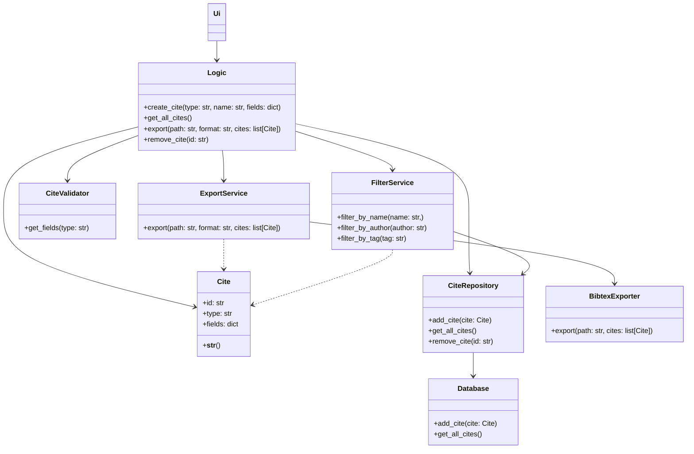

# Arkkitehtuuri

Sovellus noudattaa [Repository](https://ohjelmistotekniikka-hy.github.io/python/toteutus#repository-suunnittelumalli) mallia.
Sovelluksen koodit on jaettu/luokitettu neljään kerrokseen:

- Käyttöliittymä
- Logiikka
- Repository: Vastaa tietyn luokan olioiden tietojen lisäämisestä/muokkauksesta.
  Esim. `Viite`-luokalle `ViiteRepository`.
- Infrastruktuuri: Abstrahoi alimman tason operaatiot, esim. tietokantaoperaatiot tai tiedoston luku.

## Hahmotelma mallista


## Luokkakaavio



## SQL-skeema

```SQL
CREATE TABLE IF NOT EXISTS cites (
    id INTEGER PRIMARY KEY AUTOINCREMENT,
    name TEXT,
    entry_type TEXT,
    fields TEXT
);
```
