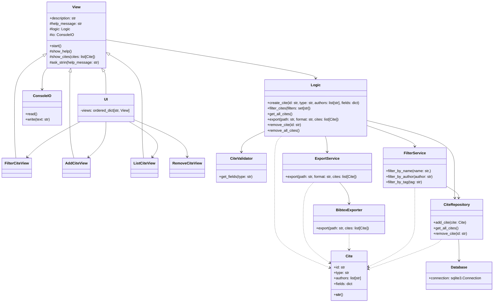

# Arkkitehtuuri

Sovellus noudattaa [Repository](https://ohjelmistotekniikka-hy.github.io/python/toteutus#repository-suunnittelumalli) mallia.
Sovelluksen koodit on jaettu/luokitettu neljään kerrokseen:

- Käyttöliittymä
- Logiikka
- Repository: Vastaa tietyn luokan olioiden tietojen lisäämisestä/muokkauksesta.
  Esim. `Viite`-luokalle `ViiteRepository`.
- Infrastruktuuri: Abstrahoi alimman tason operaatiot, esim. tietokantaoperaatiot tai tiedoston luku.

## Hahmotelma mallista


## Luokkakaavio



### Käyttöliittymä

- Yhteiden yliluokka: käyttöliittymillä on paljon yhteistä
- Viitteiden listaus: tätä tarvitaan ainakin viitteiden poistossa, haussa, listauksessa.
  Näin ollen se on hyvä toteuttaa vain kerran.

## SQL-skeema

```SQL
CREATE TABLE Cites (
    id TEXT PRIMARY KEY,
    type TEXT
)

CREATE TABLE Fields (
    cite_id TEXT REFERENCES Cites,
    name TEXT,
    content TEXT
)

CREATE TABLE Authors (
    cite_id TEXT REFERENCES Cites,
    name TEXT
)
```
