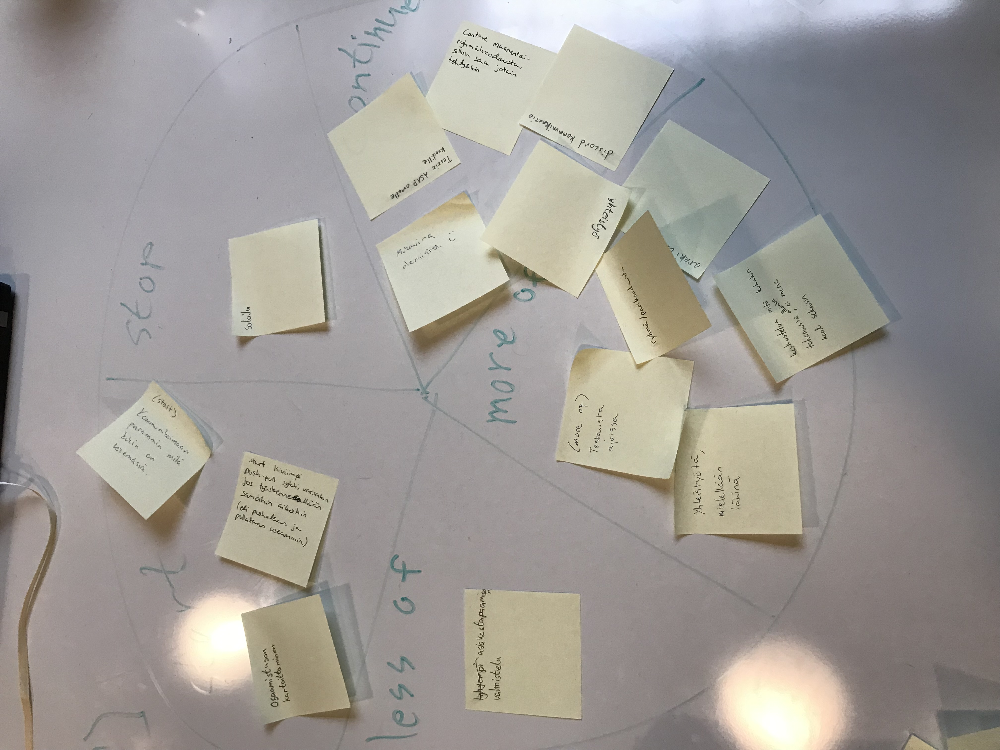

# Retrospektiividokumentti

## 30.11.2023

Retrospektiivi pidettiin Start, Stop, Continue, More of, Less of Wheel -menetelmällä.

### Muutoksia

- Pienempiä committeja, jotka pushataan useammin GitHubiin.
- Discordiin tilannepäivityskanava, johon päivitellään tilannetta useammin kuin daily scrum
- Kartoitetaan osaamistasot ennen työjakoa
- Lyhennetään valmisteluaikaa ennen asiakastapaamista puolella tunnilla
