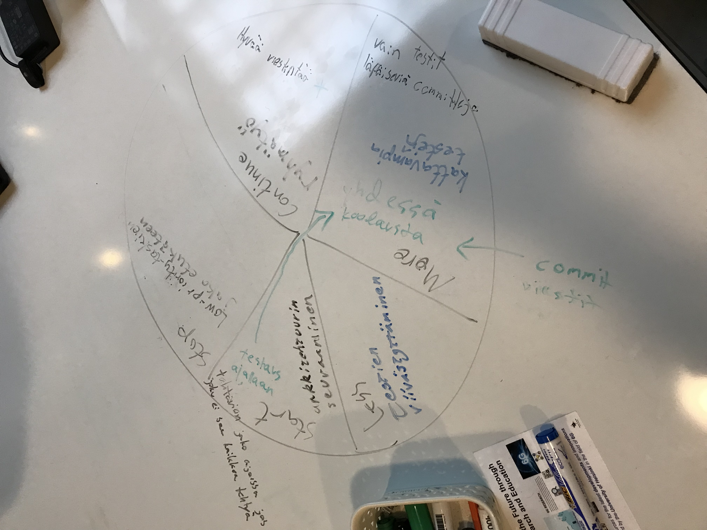

# Retrospektiividokumentti

## 30.11.2023

Retrospektiivi pidettiin Start, Stop, Continue, More of, Less of Wheel -menetelmällä.

### Muutoksia

- Pienempiä committeja, jotka pushataan useammin GitHubiin.
- Discordiin tilannepäivityskanava, johon päivitellään tilannetta useammin kuin daily scrum
- Kartoitetaan osaamistasot ennen työjakoa
- Lyhennetään valmisteluaikaa ennen asiakastapaamista puolella tunnilla

## 7.12.2023

Retrospektiivi edelleen Start, Stop, Continue, More of, Less of Wheel -menetelmällä, mutta tällä kertaa ei ollut post it -lappuja.

- Low-priority taskeja ei checkoutata etukäteen.
- Noudatetaan tiukemmin sovittua commit viesti muotoa.
- Arkkitehtuuria seurataan tarkemmin, ilmoitetaan kaikille, jos muuttaa julkisia metodeja.
- Kattavampia testejä
- Säästetään enemmän aikaa testaukselle.
